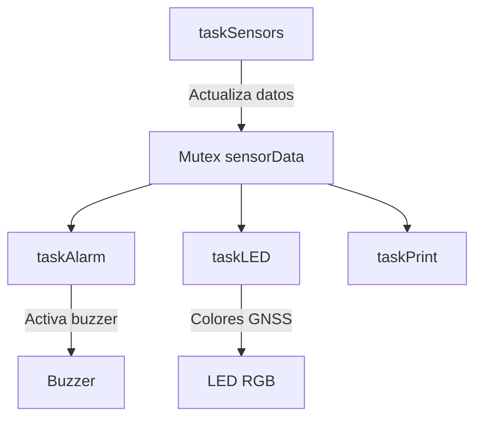

| Supported Targets | ESP32-S3 |
| ----------------- | -------- |

# ESP32-S3 IoT Perception Layer

Este proyecto implementa un **sistema IoT de percepción** con un **ESP32-S3**, integrando varios sensores y actuadores bajo un modelo concurrente con **FreeRTOS**.

---

## Características

- **GNSS (GPS)**  
  - Obtención de posición (latitud/longitud), altitud y velocidad.
  - Indicación de estado de fix (no fix / fix válido).

- **IMU (MPU6050)**  
  - Lectura de aceleración en eje X.  
  - Estimación de velocidad por integración.  
  - Filtro de Kalman para velocidad.

- **LED RGB (NeoPixel)**  
  - Indicador de estado GNSS:
    - 🔴 Rojo: sin fix.  
    - 🟢 Verde: fix adquirido (permanece verde).  

- **Buzzer / Alarma**  
  - Activación si la velocidad GNSS excede el umbral (30 km/h).

- **FreeRTOS**  
  - Cada módulo corre en su propia tarea concurrente:
    - `taskSensors`: adquisición de GNSS e IMU.  
    - `taskAlarm`: control de buzzer.  
    - `taskLED`: retroalimentación visual de GNSS.  
    - `taskPrint`: impresión periódica en Serial.

---

## 🛠️ Hardware

- ESP32-S3 DevKit  
- Módulo GNSS compatible (ej. NEO-6M, NEO-M8N) conectado vía UART  
- IMU MPU6050 conectada por I²C  
- LED RGB (WS2812 integrado o externo)  
- Buzzer (GPIO digital)  

### Conexiones sugeridas

| Componente | GPIO ESP32-S3 | Notas |
|------------|---------------|-------|
| GNSS RX    | 17            | UART1 RX |
| GNSS TX    | 18            | UART1 TX |
| IMU SDA    | 45            | I²C SDA |
| IMU SCL    | 35            | I²C SCL |
| LED RGB    | 48            | WS2812 integrado |
| Buzzer     | 10            | Salida digital |

---

## Estructura del Proyecto

```
/src
├── main.cpp                # Código principal con tareas FreeRTOS
├──/lib
|   ├──/gnss
|   |   ├── gnss.hpp        # Clase GNSS
|   |   └── gnss.cpp         
|   ├──/imu
|   |   ├── imu.hpp          # Clase IMU (MPU6050)
|   |   └── imu.cpp
|   └──/platform
|       ├── platform.hpp     # Definiciones de LED, buzzer, etc.
|       └── platform.cpp   
|
└──platformio.ini            # Gestor de librerias de Platformio

```

---

## Ejecución

1. Clona este repositorio:

   ```bash
   git clone git@github.com:jusanchez6/IoT-project.git
   cd esp32-iot-perception
    ```

2. Abre el proyecto en **PlatformIO** o **Arduino IDE** con soporte para **ESP32-S3**.

3. Conecta el ESP32-S3 y selecciona el puerto.

4. Compila y carga:

   ```bash
   pio run --target upload
   ```

5. Abre el monitor serie:

   ```bash
   pio device monitor
   ```

---

## Salida en Serial

Ejemplo de impresión en `taskPrint`:

```
GNSS Ready: YES | Lat: 6.251234 | Lng: -75.563456 | Alt: 1543.21 m | Vel: 12.34 km/h
|| IMU AccX: 0.98 | Vel (measured): 1.23 | Vel (Kalman): 1.10
```

---

## 📊 Diagrama de Tareas



---

## 📅 Roadmap

* [x] Integración GNSS
* [x] Integración IMU
* [x] Control LED y buzzer con FreeRTOS
* [ ] Conexión WiFi y envío de datos a servidor IoT
* [ ] Migración a UDP/TCP para comunicación con backend

---

## 👨‍💻 Autor

**Julián Sánchez**
📅 15/09/2025

---

## 📜 Licencia

Este proyecto se distribuye bajo la licencia **MIT**.

